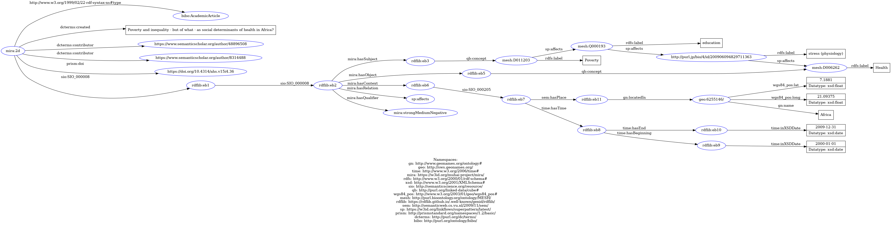

# MIRA - A Knowledge Graph for Social Demography Hypotheses and Findings.

This github presents the MIRA-KG, a knowledge graph designed to capture hypotheses and findings in social demography research. The resource aids researchers in understanding the trends and patterns revealed in social demography, and use them to discover biases, discover knowledge, and derive novel questions.

## Table of Contents
- [Overview](#overview)
- [Getting Started](#getting-started)
- [Prerequisites](#prerequisites)
- [Usage](#usage)
- [Contributing](#contributing)
- [License](#license)
- [Acknowledgments](#acknowledgments)

## Overview

Research questions for social history research, such as from social demography, commonly include (i) descriptive questions, (ii) comparative questions, and (iii) explanatory questions. Here, each question is based on the output from the previous one. Preferably, these questions are all derived from one another, and from the dataset. See the image below. The MIRA ontology thus links datasets to research questions to accommodate the research workflow of a social demographer/social historian towards more reusable, reproducible research. An example workflow is shown below. 


The [ontology](https://w3id.org/mira/ontology/) is populated by structured research questions on health inequality, extracted from abstracts of research papers, and is published on [Zenodo](https://doi.org/10.5281/zenodo.10286846), and queriable via a [SPARQL endpoint](
https://api.druid.datalegend.net/datasets/lisestork/MIRA-KG/services/MIRA-KG/sparql).

This [github](https://github.com/muhai-project/mira/) contains the ontology, example annotations, scripts to produce structured annotations automatically from paper abstracts (explanatory questions and metadata of evidence used to answer the RQs), and SHACL shapes for the validation of generated annotations.

### Prerequisites

1. clone the project
```
git clone https://github.com/muhai-project/mira.git
```

2. set up an environment (like anaconda) from the requirement.txt file
```
pip install -r requirements.txt
```

### Usage

The semantify.py script turns research paper abstracts of papers on social demography into RDF according to the MIRA ontology. It does so by: (i) prompting a Large Language Model to annotate paper abstracts, (ii) mapping concepts to terms from NCBO BioPortal ontologies and Geonames. An example annotation is shown in the figure below:




To test the code, you can use the example paper_file.pkl file with papers on social health inequality.

```
python semantify.py --paper_file ../data/paper_file.pkl --api_key "your api key" --output ../data/test_output.ttl --max 1 --view 1
```

The location of the input file, the openAI api key, and the output file are required arguments. Max and view are optional and indicate how many papers to process, and whether to print the serialised RDF after each step. _To check whether all works as expected, we recommend to first set these to 1 and True, before processing a large batch._

The --paper_file argument expects the location of a pickle file (.pkl) which consists of a list of dictionaries with the following keys:
dict_keys(['paperId','title','abstract','year','publicationDate','authors','references'])
These can, for instance, be retrieved from Semantic Scholar:

```
from semanticscholar import SemanticScholar

sch = SemanticScholar()
results = sch.search_paper('',year=, fields_of_study=[''])
papers = [sch.get_paper(result.paperId) for result in results]
```

You can use the validate.py script to validate the set against a set of SHACL shapes, developed according to a set of data quality criteria.

```
python validate.py --batch_file ../data/test_output.ttl --shacl_file ../validation/shacl-shapes.ttl --validation_output validation_results.ttl --view 1
```
## License

This project is licensed under the [Creative Commons Attribution-ShareAlike 4.0 International License](https://creativecommons.org/licenses/by-sa/4.0/).

## Acknowledgments
This work was funded by the European MUHAI project (Horizon 2020 research and innovation program) under grant agreement
number 951846. We thank Tobias Kuhn and Inès Blin for the insightful discussions that contributed to this work.

---
